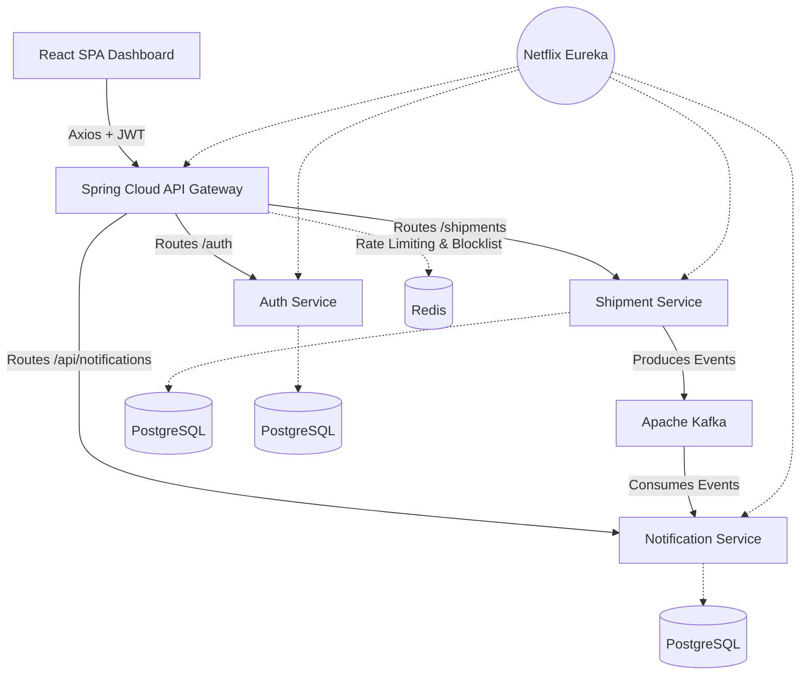
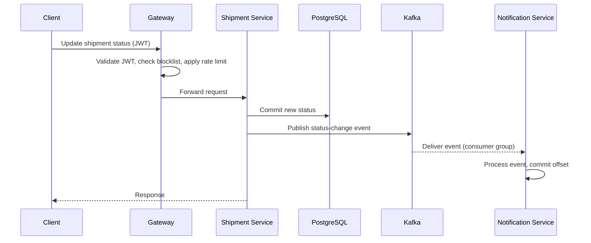

# Smart Shipment: Event-Driven Logistics Platform

A microservices backend for tracking international freight shipments, built with **Java, Spring Boot, Kafka, Redis and PostgreSQL**, with a React dashboard on top. Shipment status changes are published as events and consumed asynchronously, so services stay decoupled and the platform can be observed in real time.

> **Scope note:** The backend (all Spring Boot services and infrastructure) is my own design and implementation. The React dashboard was built with AI assistance so I could spend my time on the distributed-systems side.

## Business Value & Commercial Use Case

In the global freight forwarding industry (e.g., 3PL providers like DP World or Maersk), cargo visibility is critical. A single international shipment changes hands dozens of times across ports, customs, and last-mile carriers. **Smart Shipment** solves the "supply chain black hole" problem by acting as a central nervous system for B2B logistics. It allows enterprise operators to track cargo state in real-time, instantly notifying downstream stakeholders (warehouses, customs brokers) of delays or arrivals via asynchronous event streams, ultimately reducing demurrage fees and improving supply chain predictability.

---

## Highlights

- **Event-driven status tracking:** the Shipment Service publishes status changes to Kafka; the Notification Service consumes them independently.
- **Service discovery and routing:** Netflix Eureka plus Spring Cloud Gateway as the single entry point.
- **JWT authentication with revocation:** tokens are validated at the gateway; logout adds the token to a Redis blocklist with a TTL equal to its remaining lifetime.
- **API-level rate limiting:** Redis-backed token bucket at the gateway, configured per endpoint to mitigate abuse and brute-force attempts.
- **Resilience:** Circuit breaker with a fallback on calls to the Shipment Service, so failures degrade gracefully instead of surfacing raw exceptions.
- **Operational visibility:** the dashboard shows live Eureka registrations, service health and circuit breaker state from Spring Boot Actuator.
- **Database per service:** Shipment, Auth and Notification each own their PostgreSQL schema; services communicate only through APIs and events.

---

## Architecture



| Service | Responsibility |
|---|---|
| **API Gateway** | Single entry point: routing, JWT validation, rate limiting, CORS |
| **Auth Service** | Authentication, JWT issuance, logout/revocation |
| **Shipment Service** | Core business logic: shipment lifecycle and status transitions; Kafka producer |
| **Notification Service** | Kafka consumer; reacts to status-change events |
| **Eureka Server** | Service registry and discovery |

### Status update flow



---

## Security Model

- Credentials are verified by the Auth Service (Spring Security); on success it issues a signed JWT.
- The gateway validates the signature and expiry locally on every request, so there is no per-request call to the Auth Service.
- **Revocation:** stateless JWTs cannot be invalidated on their own. On logout the token's identifier is written to a Redis set with a TTL matching its remaining lifetime, and the gateway checks this blocklist before accepting a token.
- **Rate limiting** is applied per endpoint, with stricter limits on authentication routes.
- The dashboard masks the session token by default; it is never displayed in full unless explicitly revealed.

## Resilience

- **Circuit breaker (Resilience4j)** on inter-service calls to the Shipment Service. When the breaker is open, callers receive a structured fallback response instead of a stack trace.
- **Service discovery:** each service caches the Eureka registry locally, so existing routes keep working through a brief Eureka outage.
- **Health monitoring:** Actuator health and Eureka state are surfaced in the dashboard's System Health page.

---

## Tech Stack

**Backend:** Java, Spring Boot 3.x, Spring Cloud Gateway, Spring Cloud Netflix Eureka, Spring Security + JWT, Resilience4j, Apache Kafka, Redis, PostgreSQL (production), H2 (local/test profile)

**Frontend:** React 18, Vite, Tailwind CSS, Recharts, Axios, Lucide React

**Infrastructure:** Docker, Docker Compose

---

## Screenshots

| Dashboard | System Health | Shipments |
|---|---|---|
|  |  |  |

---

## Running Locally

**Prerequisites:** Docker, Docker Compose, Node.js 18+

```bash
# 1. Clone
git clone https://github.com/yashjangrra/smart-shipment-microservices.git
cd smart-shipment-microservices

# 2. Start backend infrastructure and services (Kafka, Redis, PostgreSQL, Eureka, Gateway, Auth, Shipment, Notification)
docker-compose up -d

# 3. Start the frontend
cd smart-shipment-frontend
npm install
npm run dev
```

Open `http://localhost:5173`. Eureka dashboard: `http://localhost:8761` (default port; adjust if you changed it).

---

## Design Decisions and Trade-offs

**Why Kafka instead of RabbitMQ?**
Tracking updates are a continuous, high-volume stream. Kafka's append-only log gives high throughput and replayability, which matters for audit history in logistics. The trade-off is heavier operational overhead than a simple queue.

**Why an API Gateway?**
The frontend talks to one address instead of every service. CORS, rate limiting and JWT validation live in one place rather than being duplicated across services. The trade-off is that the gateway is a critical path component that must itself be kept healthy and horizontally scalable.

**Why database per service?**
It prevents hidden coupling through shared tables and keeps services independently deployable. The trade-off is that cross-service consistency is eventual, achieved through events rather than transactions.

**Why validate JWTs locally at the gateway?**
It avoids a network call and a single point of failure on every request. The trade-off is that revocation needs extra state, which is why the Redis blocklist exists.

**Why a Vite dev proxy?**
It sidesteps browser CORS restrictions in development without loosening the backend's security configuration.

---

## Known Limitations and Roadmap

I'd rather list these than have them discovered:

- **Dual-write gap:** the database commit and the Kafka publish are not atomic. A failure between them can lose an event. *Planned:* transactional outbox pattern.
- **Delivery semantics:** consumers are at-least-once, so reprocessing after a crash or rebalance is possible. *Planned:* idempotent consumer using event IDs.
- **Poison messages:** *Planned:* dead-letter topic with bounded retries.
- **Token signing:** JWTs are signed with a shared secret (HMAC). *Planned:* asymmetric signing (RS256) so verifying services never hold signing capability, plus refresh tokens with shorter-lived access tokens.
- **Rate limiting is not DDoS protection.** It operates at the application layer; volumetric attacks need an edge layer (CDN/WAF) in front of the gateway.
- **Observability:** health is exposed via Actuator; distributed tracing and centralized logging are not yet implemented.
